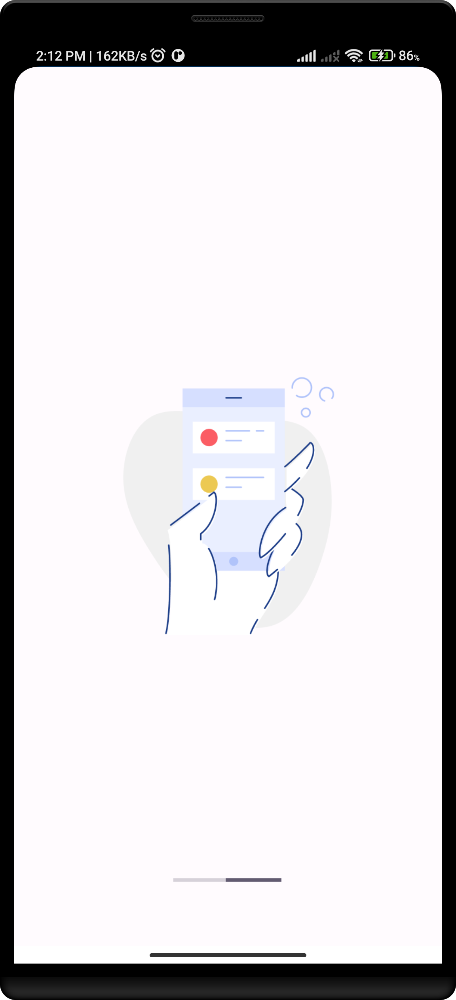
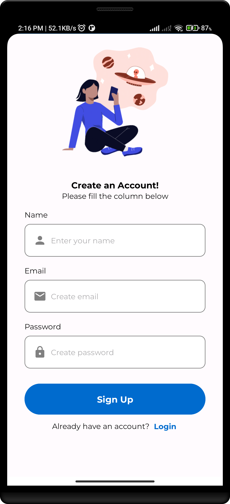
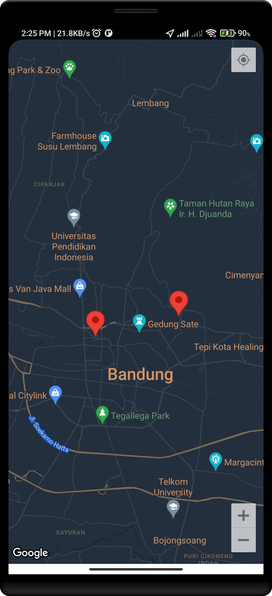

# Story App

Story App merupakan aplikasi berbasis Android dengan menggunakan data dari API Dicoding,
yang memungkinkan kita untuk membagikan "Cerita" berupa gambar, deskripsi serta lokasi sehingga dapat dilihat oleh orang lain,
begitupun sebaliknya kita dapat melihat "Cerita" orang lain juga.

## Feature
- Authentication
- Add Story
- Localization (English, Indonesia)
- Maps

## Language and Tools

  
  
  
  

## Screenshots
<table>
  <tr>
    <td>Splash Screen</td>
  </tr>
  <td>
    
  </td>

  <tr>
    <td>Welcome Screen</td>
  </tr>
  <td>
    
  </td>
  <td>
    
  </td>

  <tr>
    <td>Authentication</td>
  </tr>
  <td>
    
  </td>
  <td>
    
  </td>

  <tr>
    <td>Dashboard</td>
  </tr>
  <td>
    
  </td>

  <tr>
    <td>Upload Story</td>
  </tr>
  <td>
    
  </td>

  <tr>
    <td>Maps Story</td>
  </tr>
  <td>
    
  </td>
</table>
  
